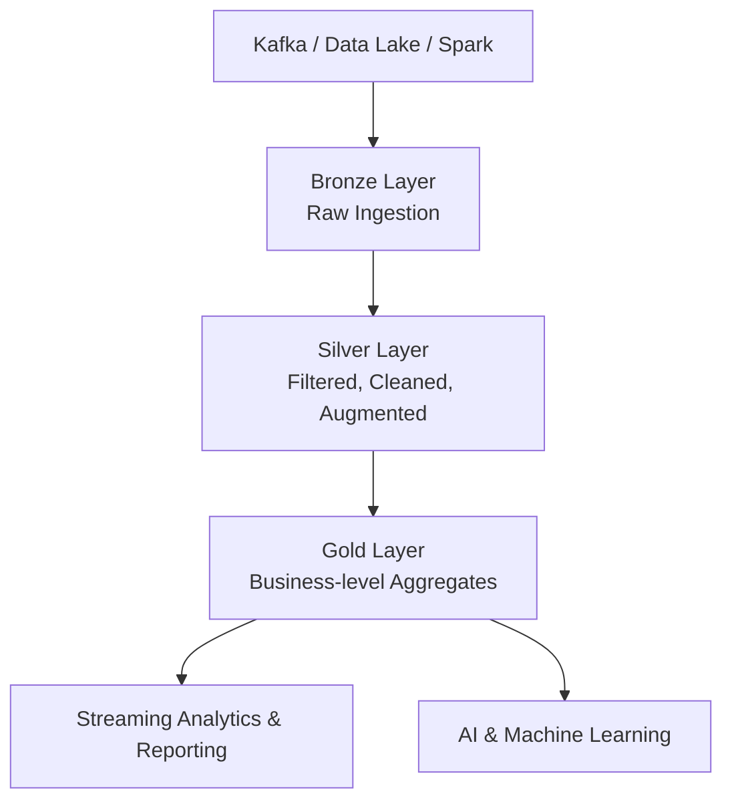

# Delta Lake & Lakehouse Concepts

---

## What is a Data Lake?

A **Data Lake** is a centralized repository that allows you to store all your structured and unstructured data at any scale.

### The Promise of Cloud Data Lakes:
1. **Collect Everything**
2. **Store it All in the Data Lake**
3. Use it for **Machine Learning** and **Data Science**

### Limitations of Traditional Data Lakes:
- Historically used to capture large amounts of data **quickly**, without knowing if or how the data will be used.
- Often results in:
  - **Unclean**
  - **Inaccurate**
  - **Incomplete** data

### Garbage In → Garbage Stored → Garbage Out (GIGO)

---

## What is Delta Lake?

**Delta Lake** is an open-source storage layer that brings **ACID transactions** to Apache Spark and big data workloads.

- Runs on top of existing cloud object stores (e.g. **S3**, **Azure Data Lake Storage**, **Google Cloud Storage**).
- Enables **reliable**, **high-quality**, and **governed** data lakes.

### Problems Solved by Delta Lake:
- Lack of **ACID transactions**.
- Lack of **schema enforcement**.
- No **versioning** / **time travel**.
- **Poor data quality** and lack of governance.

---

## What is a Data Lakehouse?

A **Data Lakehouse** is a modern architecture that combines:
- The low-cost, flexible storage of a **Data Lake** with
- The performance, reliability, and governance of a **Data Warehouse**.

### Enables:
- Business Intelligence (**BI**) & Reporting
- Machine Learning & AI
- Streaming Analytics
- High-quality, governed data pipelines

### Key Value:
Delta Lake allows you to **incrementally improve the quality of your data** until it is ready for consumption.

---

## Lakehouse Architecture Flow


## Key Features of Delta Lake

- **ACID Transactions** (Atomicity, Consistency, Isolation, Durability)
- **Schema enforcement** and evolution
- **Time travel** — view older versions of data
- **Streaming + Batch** processing support
- **Incremental data quality improvements**

---

## Data Quality Levels

- **Bronze** → Raw Ingestion
- **Silver** → Filtered, Cleaned, Augmented Data
- **Gold** → Business-level Aggregates used for:
  - **Streaming Analytics**
  - **AI & Machine Learning**
  - **Reporting**

---
## Data Objects in Databricks


# 📊 **2️⃣ Metastore Architecture Diagram**

```mermaid
graph TD
    A[Metastore] --> B[Catalog]
    B --> C[Schema<br>(Database)]
    C --> D1[Managed Table]
    C --> D2[External Table]
    C --> D3[View]
    C --> D4[Function]

    D1 --> E1[Metastore Storage<br>(Default Location)]
    D2 --> E2[External Storage<br>S3 / ADLS / GCS]

    subgraph Workspace
        F[Workspace Linked to Metastore]
    end
```
### Metastore
- Built by Databricks Administrator.
- Root location where **Catalog**, **Schema**, **Table**, **View**, and **Function** metadata are stored.
- Each **Workspace** is assigned to a specific **Metastore**.

### Workspaces
- Logical environment containing:
  - Notebooks
  - Clusters
  - Jobs
  - Repos
  - Linked to a **Metastore**.

---

## Table Types

### Managed Table
- Stored in **Metastore-managed storage**.
- Data is written to default storage location.
- Dropping the table deletes data from storage.

### External Table
- Points to data stored in **external storage**:
  - S3
  - Azure Storage Account
  - GCS
- Managed via:
  - **External Locations**
  - **Storage Credentials**

---

## Views

- **Temporary View** → Session-scoped.
- **Global Temporary View** → Shared across sessions.
- **Standard View** → Permanent logical view saved in Metastore.

---

## Functions

- Saved logic (user-defined functions, UDFs) that can be reused in queries.

---

# Advanced Delta Lake Features

---

## Liquid Clustering

### What is Liquid Clustering?
- A new approach → no more static partitions.
- Faster writes, comparable read performance to well-tuned partitioned tables.
- Self-tuning → avoids over- and under-partitioning.
- Incremental, automatic partial clustering of new data.
- Skew-resistant → consistent file sizes and low write amplification.

### Scenarios that Benefit from Liquid Clustering:
- Tables often filtered by **high-cardinality columns**.
- Tables with **significant data skew**.
- Fast-growing tables requiring maintenance & tuning.
- Tables with **concurrent write** requirements.
- Tables where access patterns **change over time**.
- Tables where typical partition keys would cause:
  - Too many partitions
  - Too few partitions

---

## Deletion Vectors

### Before:
- Changing table data required a **full rewrite**.

### After:
- **Deletes**, **Updates**, and **Merges** are written to a **Deletion Vector File**.

### Benefits:
- Improves performance.
- Enables more efficient data updates.

---

## Photon + Predictive I/O

**Photon Engine** leverages **Deletion Vectors** for **Predictive I/O**, accelerating:
- DELETE
- MERGE
- UPDATE operations.

### What is Predictive I/O?
- Automates **OPTIMIZE** and **VACUUM** operations.
- Makes the Lakehouse a **smarter data warehouse**.

---

# Summary

Delta Lake and the Data Lakehouse architecture address key limitations of traditional Data Lakes:
- Improve data quality **step by step**.
- Enable **governed, high-quality** analytics & AI/ML.
- Support both **streaming** and **batch** pipelines.
- **Prevent "Garbage In → Garbage Out."**

---